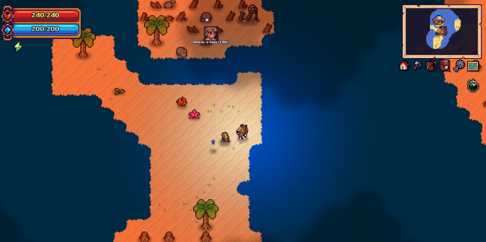

# 🎮 Tinkerlands Mods Collection

A personal collection of high-quality, lightweight, and performance-driven Quality of Life (QoL) mods for **Tinkerlands**. Continuously maintained and updated with new features and enhancements whenever inspiration strikes!

[](https://github.com/telles0808)
[](https://opensource.org/licenses/MIT)
[]()
[]()

---

## 📦 Available Mods

| Mod | Description | Status | Download |
| :--- | :--- | :---: | :---: |
| **[Better Organizer (v1.0)](#-better-organizer-bo-v10)** | Smart inventory deposit system with interactive 7-channel chest filter bars, category routing, and hotbar protection. | ✅ Stable | [⬇️ Download BO.mod](https://github.com/telles0808/Tinkerlands-Mods/raw/main/releases/BO.mod) |
| **[NPC Radar (v1.3)](#-npc-radar-v13)** | Real-time NPC tracker with HUD toggle button, custom portraits, and distance indicators. Zero FPS lag. | ✅ Stable | [⬇️ Download Radar.mod](https://github.com/telles0808/Tinkerlands-Mods/raw/main/releases/Radar.mod) |
| **[RealClock (v1.0)](#-realclock-v10)** | Displays the computer's real local time in a responsive 24-hour HUD clock without requiring the Clock accessory. | ✅ Stable | [⬇️ Download RealClock.mod](https://github.com/telles0808/Tinkerlands-Mods/raw/main/releases/RealClock.mod) |
| **[Fog (v1.0)](#-fog-v10)** | Modifies the minimap fog layer to provide 95% translucent visibility across explored areas. | ✅ Stable | [⬇️ Download Fog.mod](https://github.com/telles0808/Tinkerlands-Mods/raw/main/releases/Fog.mod) |

---

## 📥 Installation

1. Download the `.mod` file for the desired mod from the [Releases](releases/) folder (or direct links above).
2. Locate your **Tinkerlands** installation folder:
   ```
   C:\Program Files (x86)\Steam\steamapps\common\Tinkerlands\mods\
   ```
   *(or wherever your Steam library is located)*
3. Paste the `.mod` file directly inside the `mods` folder.
4. **💡 (Recommended) Clear Game Cache:** To ensure newly added or updated mods are immediately reloaded by the engine without using cached scripts:
   * Press `Win + R`, paste `%LOCALAPPDATA%\Tinkerlands\temp` and press **Enter**.
   * Delete all cached files inside this `temp` folder.
5. Launch the game!

---

## 🛠️ Mod Details

### 📦 Better Organizer / BO (v1.0)
* **Interactive 7-Category Filter Bar:** Pinned seamlessly onto the top frame of any opened chest (standard or astral).
* **Two-Tier Priority Routing:** Fills existing incomplete piles first before claiming new chest slots.
* **Hotbar Action Row Guard:** Row 0 (active inventory action slots) is never touched during automatic deposits.
* **Native Engine Transfer:** Integrates directly with `container_item_move` for instant, duplicate-free transfers.
* **Physical Position Persistence:** Filter settings are keyed by real world-coordinates (`chest_x[X]_y[Y]`) and automatically saved in `BO_filters.cfg`.
* **Dedicated HUD Button:** Adds a custom `BO` button right next to the native inventory quick-stack controls.
* **Preview:**

  

* **Documentation & Source:** [mods/BO/README.md](mods/BO/README.md) • [mods/BO/src/BO.gml](mods/BO/src/BO.gml)

---

### 📡 NPC Radar (v1.3)
* **Dynamic Off-Screen Tracking:** Shows directional arrows with character portraits pointing to all NPCs on the island.
* **In-Screen Identification:** Displays NPC portraits and names directly above entities within your field of view.
* **On/Off Toggle Button:** Integrated cleanly onto the HUD near the minimap (click the Sonar icon to toggle).
* **Native $O(1)$ ID Lookup:** Resolves character portraits via the game's internal `npcID` database table, ensuring full compatibility with localized and generic humanoid NPCs.
* **Ultra-Smooth 60 FPS:** Uses batch coordinate updating and identity resolution throttling for zero stutters.
* **Preview:**

  

* **Documentation & Source:** [mods/Radar/README.md](mods/Radar/README.md) • [mods/Radar/src/Radar.gml](mods/Radar/src/Radar.gml)

---

### 🕒 RealClock (v1.0)
* **Real Local Time:** Displays the computer's current time in 24-hour `HH:MM` format instead of the in-game day cycle.
* **No Accessory Required:** Remains available without equipping the Clock accessory.
* **Native HUD Style:** Uses Tinkerlands' embedded pixel font with high-visibility yellow text.
* **Responsive Placement:** Scales from a 1920×1080 reference area and stays anchored to the top-right corner across all resolutions.
* **Topmost Draw Layer:** Renders on top of the native GUI so the minimap cannot cover it.
* **Preview:**

  

* **Documentation & Source:** [mods/RealClock/README.md](mods/RealClock/README.md) • [mods/RealClock/src/RealClock.gml](mods/RealClock/src/RealClock.gml)

---

### 🌫️ Fog (v1.0)
* **Enhanced Exploration:** Adjusts the alpha channel on the minimap surface, rendering the explored map with 95% translucency.
* **Seamless:** Hooks directly into `MINIMAP.render_surface` without interfering with game saves or world generation.
* **Preview:**

  

* **Documentation & Source:** [mods/Fog/README.md](mods/Fog/README.md) • [mods/Fog/src/Fog.gml](mods/Fog/src/Fog.gml)

---

## 📖 Technical Documentation
For developers and modders looking to understand Tinkerlands' engine variables, lifecycle hooks, and NPC architecture:
* 📄 **[Tinkerlands Modding & Engine Reference Guide](MODDING_GUIDE.md):** Detailed guide on GML mod packaging, global variables, lifecycle events, $O(1)$ `npcID` resolution, container hooks, and minimap rendering.

---

## 🔨 Building from Source

### ⚙️ Prerequisites & Environment
Before building the mods from source, ensure you have:
* **Operating System:** Windows 10 or 11.
* **PowerShell:** Version 5.1+ (built into Windows) or [PowerShell 7+](https://github.com/PowerShell/PowerShell).
* **Git:** [Git for Windows](https://git-scm.com/) to clone the repository.
* **Tinkerlands (Steam):** Required only if using the `-Deploy` flag to auto-copy to your game's directory.

> [!NOTE]
> **No external compilers or C++ tools are needed.** The automated build script (`build.ps1`) handles all GML string encoding (`#$#` / `%$%`), JSON manifest generation, and ZIP `.mod` packaging natively via PowerShell.

### 🚀 Build Steps

1. **Clone the Repository:**
   ```powershell
   git clone https://github.com/telles0808/Tinkerlands-Mods.git
   cd Tinkerlands-Mods
   ```

2. **(If needed) Allow PowerShell Script Execution:**
   Windows may restrict running unsigned `.ps1` scripts by default. In your PowerShell terminal, run:
   ```powershell
   Set-ExecutionPolicy -Scope Process -ExecutionPolicy Bypass
   ```

3. **Compile the Mods:**
   ```powershell
   # Compile Better Organizer (BO) mod:
   .\tools\build.ps1 -ModName BO

   # Compile Radar mod:
   .\tools\build.ps1 -ModName Radar

   # Compile Fog mod:
   .\tools\build.ps1 -ModName Fog

   # Compile RealClock mod:
   .\tools\build.ps1 -ModName RealClock

   # Compile and automatically deploy directly to your Steam Tinkerlands mods folder:
   .\tools\build.ps1 -ModName BO -Deploy
   ```

The compiled mod packages will be output to both `mods/<ModName>/dist/<ModName>.mod` and `releases/<ModName>.mod`.

---

## 📄 License

This project is licensed under the MIT License - see the [LICENSE](LICENSE) file for details.
