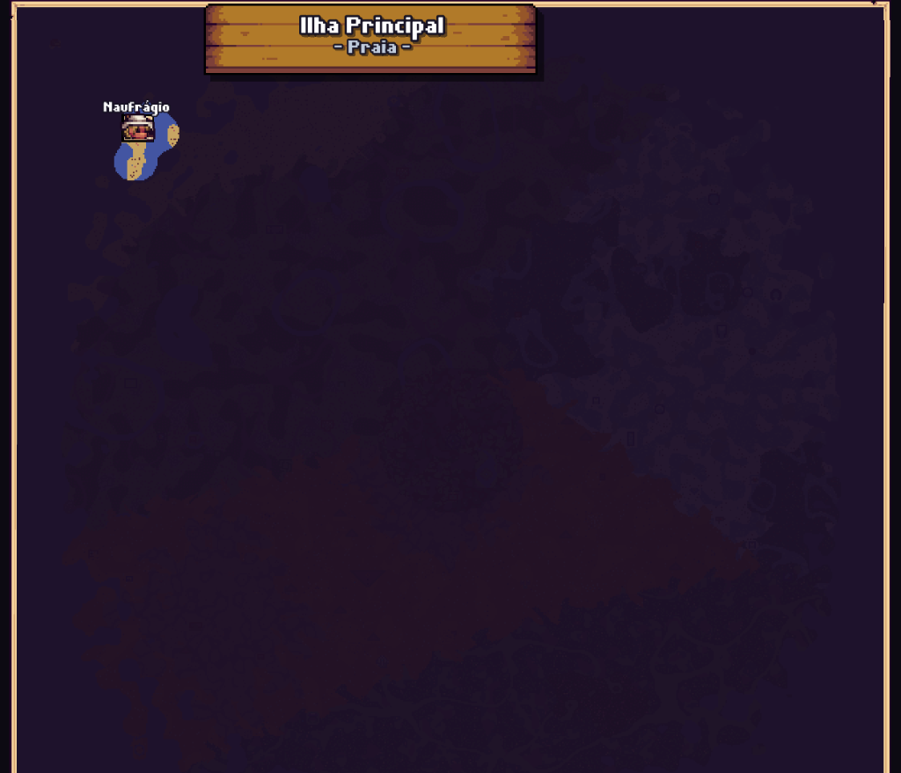
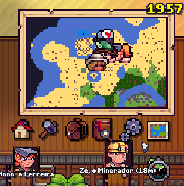
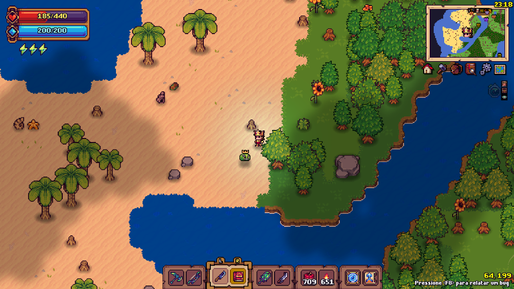

# 🛠️ Tinkerlands Mods Collection

A curated collection of quality-of-life, navigation, automation, and visual enhancement mods for **[Tinkerlands](https://store.steampowered.com/app/2617700/Tinkerlands/)** by **Telles0808**.

---

## 📥 Quick Downloads

All pre-compiled and ready-to-play `.mod` files are available in the table below and inside the [`releases/`](releases/) folder:

| Mod | ID | Description | Status | Direct Download |
| :--- | :---: | :--- | :---: | :--- |
| **[Fog](#-fog-id-5001)** | `5001` | Map surface translucency enhancer: renders explored fog of war with 95% opacity. | ✅ Stable | [⬇️ Download Fog.mod](https://github.com/telles0808/Tinkerlands-Mods/raw/main/releases/telles0808_id5001_fog.mod) |
| **[RealClock](#-realclock-id-5002)** | `5002` | Real-world 24-hour local computer time in the top-right corner without needing the Clock accessory. | ✅ Stable | [⬇️ Download RealClock.mod](https://github.com/telles0808/Tinkerlands-Mods/raw/main/releases/telles0808_id5002_realclock.mod) |
| **[Better Organizer](#-better-organizer-id-5003)** | `5003` | Chest automation & organization: 7-category filter bar with hotbar protection and persistent routing. | ✅ Stable | [⬇️ Download BO.mod](https://github.com/telles0808/Tinkerlands-Mods/raw/main/releases/telles0808_id5003_bo.mod) |
| **[TomTom](#-tomtom-id-5004)** | `5004` | Advanced GPS waypoint manager with interactive map pins, dual-layer radar, mob tracking, and automatic death tombstone pins. | ✅ Stable | [⬇️ Download TomTom.mod](https://github.com/telles0808/Tinkerlands-Mods/raw/main/releases/telles0808_id5004_tomtom.mod) |

---

## ⚡ Installation Guide

1. Download the desired `.mod` file from the table above.
2. Locate your **Tinkerlands** installation folder:
   ```
   C:\Program Files (x86)\Steam\steamapps\common\Tinkerlands\mods\
   ```
3. **⚠️ (Recommended) Remove Old Mod Versions:** Delete any previous versions of the mod from your `mods\` folder to prevent conflicts.
4. Paste the new `.mod` file into the `mods\` folder.
5. **💡 Clear Game Cache:**
   * Press <kbd>Win</kbd> + <kbd>R</kbd>, type `%LOCALAPPDATA%\Tinkerlands\temp` and press **Enter**.
   * Delete any files inside the `temp` folder so the engine loads the new scripts immediately.
6. Launch the game!

---

## 📦 Mod Catalog

### 🌫️ Fog (ID: 5001)
* **Translucent Minimap Exploration:** Adjusts the alpha channel on the minimap surface, rendering the explored map with 95% translucency.
* **Preview:**

  

* **Documentation & Source:** [mods/Fog/README.md](mods/Fog/README.md) • [mods/Fog/src/telles0808_id5001_fog.gml](mods/Fog/src/telles0808_id5001_fog.gml)

---

### 🕒 RealClock (ID: 5002)
* **Real Local Time:** Displays your computer's current 24-hour time (`HH:MM`) directly on the HUD.
* **No Accessory Required:** Works out of the box without occupying an equipment accessory slot.
* **Preview:**

  

* **Documentation & Source:** [mods/RealClock/README.md](mods/RealClock/README.md) • [mods/RealClock/src/telles0808_id5002_realclock.gml](mods/RealClock/src/telles0808_id5002_realclock.gml)

---

### 📦 Better Organizer (ID: 5003)
* **Interactive 7-Category Filter Bar:** Pinned seamlessly onto the top frame of opened containers.
* **Two-Tier Priority Routing:** Fills incomplete piles first before claiming new slots.
* **Hotbar Action Row Guard:** Active hotbar slots are never touched during deposits.
* **Preview:**

  

* **Documentation & Source:** [mods/BO/README.md](mods/BO/README.md) • [mods/BO/src/telles0808_id5003_bo.gml](mods/BO/src/telles0808_id5003_bo.gml)

---

### 🧭 TomTom (ID: 5004)
* **Dual-Layer Anti-Overlap Radar:** Separates monster/chest indicators (outer ring) from NPC indicators (inner ring) so directional cues never collide.
* **Automatic Death Tombstone:** Automatically places a persistent grave pin where you die, guiding you straight back to your lost items.
* **Entity & Mob Tracking:** Detects nearby monsters, critters, and bosses with real creature portraits and distance in meters.
* **Interactive Fullscreen Map:** Drag and drop 5 pin categories (waypoints, chests, points of interest, bosses, and death pins) with live coordinates and trash deletion.
* **Modular Sonar Controller:** HUD master button with 3 dedicated sub-toggles to filter NPCs, chests, or mobs on the fly.
* **Clean In-Screen Aesthetics:** Hides portraits when NPCs enter your screen, displaying their name neatly beneath their feet.
* **Screenshots & In-Game Showcase:**

  | Dual-Layer Radar & Entity Tracking | Minimap Radar Mode | Fullscreen Map & Death Pin |
  | :---: | :---: | :---: |
  |  |  |  |

* **Documentation & Source:** [mods/TomTom/README.md](mods/TomTom/README.md) • [mods/TomTom/src/telles0808_id5004_tomtom.gml](mods/TomTom/src/telles0808_id5004_tomtom.gml)

---

## 📄 License

This project is licensed under the MIT License - see the [LICENSE](LICENSE) file for details.
