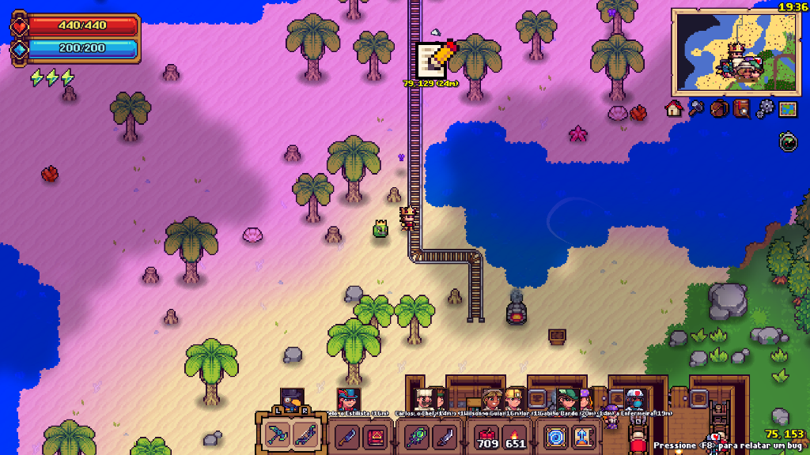

# 🎮 Tinkerlands Mods Collection

A personal collection of high-quality, lightweight, and performance-driven Quality of Life (QoL) mods for **Tinkerlands**. Continuously maintained and updated with new features and enhancements whenever inspiration strikes!

[](https://github.com/telles0808)
[](https://opensource.org/licenses/MIT)
[]()
[]()

---

## 📢 Recent Updates & Changelog

### 🧭 `telles0808_id5004_tomtom.gml` (TomTom v1.4 - ID: 5004)
* **Unification of Radar & Map Pins:** Consolidated the standalone Radar mod and MapRadar into a single unified GPS navigation suite.
* **4-Category Map Pins:** Interactive map markers for Waypoint (📍 `0`), Storage (📦 `1`), Question Mark (❓ `2`), and Boss (💀 `3`).
* **Drag-and-Drop Workflow:** Pins can be dragged from the top-left palette onto the world map canvas, picked up and moved across the terrain, or dropped into the illuminated trash bin to delete.
* **Cursor Feedback & Safe Cancel:** Moving an existing pin hides it from the canvas while attached to the mouse; closing the map restores it safely to its original position without losing data.
* **Coordinate Labels:** Displays live `(X, Y)` tile coordinates directly below each pin on the map with enlarged 1.65× scaling for enhanced legibility.
* **Dynamic TomTom Radar:** Off-screen directional projection arrows with native NPC character portraits, multiplayer player names, and pin icons plus real-time distance in meters (`Xm`).
* **HUD Sonar Toggle:** Clickable Sonar button below the minimap to toggle radar visibility on/off.
* **Bottom-Right Player Coordinates:** Real-time player tile coordinates matching RealClock HUD theme.
* **Save Persistence:** Auto-saved and loaded from `tomtom_pins.cfg`.

### 📦 `telles0808_id5003_bo.gml` (Better Organizer v1.0 - ID: 5003)
* **Interactive 7-Channel Filter Bar:** Pinned to the upper frame of all standard and astral chests.
* **Two-Tier Priority Routing:** Automatically fills existing incomplete piles before claiming new chest slots.
* **Hotbar Row 0 Protection:** Active player inventory row 0 (slots 0..9) is never automatically moved.
* **Coordinate-Based Filter Persistence:** Filter settings keyed by world coordinates `chest_x[X]_y[Y]` and persisted in `BO_filters.cfg`.
* **Native Transfer Pipeline:** Direct integration with `container_item_move` for instant, duplicate-free item routing.

### 🕒 `telles0808_id5002_realclock.gml` (RealClock v1.0 - ID: 5002)
* **24-Hour Local Time:** Displays real machine time in `HH:MM` without requiring the in-game Clock accessory.
* **Responsive HUD Positioning:** Scaled against a 1920×1080 reference geometry and anchored to the top-right corner.
* **Topmost Draw Layer:** Renders inside `OnModDrawGUIEnd` ensuring the minimap never occludes the clock text.

### 🌫️ `telles0808_id5001_fog.gml` (Fog v1.0 - ID: 5001)
* **95% Explored Map Translucency:** Intercepts `MINIMAP.render_surface` to render explored fog of war with 95% alpha translucency.
* **Zero Save Impact:** Non-destructive surface hook that leaves save files and world generation unaltered.

---

## 📦 Available Mods

| Mod | ID | Description | Status | Download |
| :--- | :---: | :--- | :---: | :---: |
| **[Fog (v1.0)](#-fog-id-5001-v10)** | `5001` | Modifies the minimap fog layer to provide 95% translucent visibility across explored areas. | ✅ Stable | [⬇️ Download Fog.mod](https://github.com/telles0808/Tinkerlands-Mods/raw/main/releases/telles0808_id5001_fog.mod) |
| **[RealClock (v1.0)](#-realclock-id-5002-v10)** | `5002` | Displays the computer's real local time in a responsive 24-hour HUD clock without requiring the Clock accessory. | ✅ Stable | [⬇️ Download RealClock.mod](https://github.com/telles0808/Tinkerlands-Mods/raw/main/releases/telles0808_id5002_realclock.mod) |
| **[Better Organizer / BO (v1.0)](#-better-organizer--bo-id-5003-v10)** | `5003` | Smart inventory deposit system with interactive 7-channel chest filter bars, category routing, and hotbar protection. | ✅ Stable | [⬇️ Download BO.mod](https://github.com/telles0808/Tinkerlands-Mods/raw/main/releases/telles0808_id5003_bo.mod) |
| **[TomTom (v1.4)](#-tomtom-id-5004-v14)** | `5004` | Unified GPS waypoint and entity tracker: drag-and-drop map pins (📍📦❓💀) with coordinates, Sonar HUD button, and dynamic off-screen directional radar for NPCs, players, and pins. | ✅ Stable | [⬇️ Download TomTom.mod](https://github.com/telles0808/Tinkerlands-Mods/raw/main/releases/telles0808_id5004_tomtom.mod) |

---

## 📥 Installation

1. Download the `.mod` file for the desired mod from the [Releases](releases/) folder (or direct links above).
2. Locate your **Tinkerlands** installation folder:
   ```
   C:\Program Files (x86)\Steam\steamapps\common\Tinkerlands\mods\
   ```
   *(or wherever your Steam library is located)*
3. Paste the `.mod` file directly inside the `mods` folder.
4. **💡 (Recommended) Clear Game Cache:** To ensure newly added or updated mods are immediately reloaded by the engine without using cached scripts:
   * Press `Win + R`, paste `%LOCALAPPDATA%\Tinkerlands\temp` and press **Enter**.
   * Delete all cached files inside this `temp` folder.
5. Launch the game!

---

## 🛠️ Mod Details

### 🌫️ Fog (ID: 5001, v1.0)
* **Enhanced Exploration:** Adjusts the alpha channel on the minimap surface, rendering the explored map with 95% translucency.
* **Seamless Surface Hook:** Hooks directly into `MINIMAP.render_surface` without interfering with game saves or world generation.
* **Preview:**

  

* **Documentation & Source:** [mods/Fog/README.md](mods/Fog/README.md) • [mods/Fog/src/telles0808_id5001_fog.gml](mods/Fog/src/telles0808_id5001_fog.gml)

---

### 🕒 RealClock (ID: 5002, v1.0)
* **Real Local Time:** Displays the computer's current time in 24-hour `HH:MM` format instead of the in-game day cycle.
* **No Accessory Required:** Remains available without equipping the Clock accessory.
* **Native HUD Style:** Uses Tinkerlands' embedded pixel font with high-visibility yellow text.
* **Responsive Placement:** Scales from a 1920×1080 reference area and stays anchored to the top-right corner across all resolutions.
* **Topmost Draw Layer:** Renders on top of the native GUI so the minimap cannot cover it.
* **Preview:**

  

* **Documentation & Source:** [mods/RealClock/README.md](mods/RealClock/README.md) • [mods/RealClock/src/telles0808_id5002_realclock.gml](mods/RealClock/src/telles0808_id5002_realclock.gml)

---

### 📦 Better Organizer / BO (ID: 5003, v1.0)
* **Interactive 7-Category Filter Bar:** Pinned seamlessly onto the top frame of any opened chest (standard or astral).
* **Two-Tier Priority Routing:** Fills existing incomplete piles first before claiming new chest slots.
* **Hotbar Action Row Guard:** Row 0 (active inventory action slots) is never touched during automatic deposits.
* **Native Engine Transfer:** Integrates directly with `container_item_move` for instant, duplicate-free transfers.
* **Physical Position Persistence:** Filter settings are keyed by real world-coordinates (`chest_x[X]_y[Y]`) and automatically saved in `BO_filters.cfg`.
* **Dedicated HUD Button:** Adds a custom `BO` button right next to the native inventory quick-stack controls.
* **Preview:**

  

* **Documentation & Source:** [mods/BO/README.md](mods/BO/README.md) • [mods/BO/src/telles0808_id5003_bo.gml](mods/BO/src/telles0808_id5003_bo.gml)

---

### 🧭 TomTom (ID: 5004, v1.4)
* **Interactive Map Pins:** Drag 4 types of custom markers (📍 Waypoint, 📦 Storage, ❓ Interest, 💀 Boss) from the palette to the fullscreen map.
* **Coordinate Labels:** Displays live tile coordinates `(X, Y)` beneath each pin placed on the map canvas with 1.65× scaling.
* **Illuminated Trash Bin:** Drag any placed pin into the glowing trash icon to delete it.
* **Dynamic TomTom Radar:** Off-screen directional arrows with NPC portraits, multiplayer names, and pin icons plus distance in meters (`Xm`).
* **Sonar HUD Toggle:** One-click Sonar accessory button below the minimap to toggle radar visibility.
* **Bottom-Right Coordinates:** High-visibility real-time `(X, Y)` player position matching the RealClock HUD theme.
* **Preview:**

  

* **Documentation & Source:** [mods/TomTom/README.md](mods/TomTom/README.md) • [mods/TomTom/src/telles0808_id5004_tomtom.gml](mods/TomTom/src/telles0808_id5004_tomtom.gml)

---

## 📖 Technical Documentation
For developers and modders looking to understand Tinkerlands' engine variables, lifecycle hooks, and NPC architecture:
* 📄 **[Tinkerlands Modding & Engine Reference Guide](MODDING_GUIDE.md):** Detailed guide on GML mod packaging, global variables, lifecycle events, $O(1)$ `npcID` resolution, container hooks, and minimap rendering.

---

## 🔨 Building from Source & 1-Click `.cmd` Scripts

### ⚡ 1-Click Automated Build Scripts (`.cmd`)

Each mod directory contains a ready-to-run Windows Command Script (`.cmd`) located right alongside its source file:

| Mod | ID | 1-Click Script Path | What It Does |
| :--- | :---: | :--- | :--- |
| **Fog** | `5001` | `mods/Fog/src/telles0808_id5001_fog.cmd` | Compiles `telles0808_id5001_fog.gml` ➔ builds `.mod` ➔ deploys to Steam ➔ increments `packver` ➔ clears game cache. |
| **RealClock** | `5002` | `mods/RealClock/src/telles0808_id5002_realclock.cmd` | Compiles `telles0808_id5002_realclock.gml` ➔ builds `.mod` ➔ deploys to Steam ➔ increments `packver` ➔ clears game cache. |
| **Better Organizer** | `5003` | `mods/BO/src/telles0808_id5003_bo.cmd` | Compiles `telles0808_id5003_bo.gml` ➔ builds `.mod` ➔ deploys to Steam ➔ increments `packver` ➔ clears game cache. |
| **TomTom** | `5004` | `mods/TomTom/src/telles0808_id5004_tomtom.cmd` | Compiles `telles0808_id5004_tomtom.gml` ➔ builds `.mod` ➔ deploys to Steam ➔ increments `packver` ➔ clears game cache. |
| **All Mods** | — | `tools/Build_All.cmd` | Compiles and deploys all 4 mods sequentially in a single click. |

---

## 📄 License

This project is licensed under the MIT License - see the [LICENSE](LICENSE) file for details.
