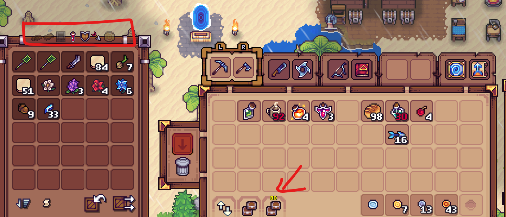

# 📦 Better Organizer (BO) Mod (v1.0)

[](https://github.com/telles0808)
[](https://opensource.org/licenses/MIT)
[]()
[]()

A comprehensive, intelligent inventory management and chest categorization mod for **Tinkerlands**. **Better Organizer (BO)** introduces dedicated in-game chest filtering, category-based routing, and a smart deposit button directly integrated into the native HUD.



---

## 🌟 Key Features

* **🗃️ 7-Channel Chest Filter Bar:** Every chest (standard or astral) gains an interactive filtering bar pinned directly to its upper frame with 7 discrete categories.
* **🎯 Two-Tier Priority Routing:**
  * **Priority 0 (Stacking First):** Items automatically complete existing partial piles in filtered chests before claiming new slots.
  * **Priority 1 (Category Matching):** If no matching stack exists, items are placed into the first empty slot of a chest matching that category bitmask.
* **🛡️ Hotbar Action Row Protection:** Row 0 (slots 0..9 of the active player inventory) is strictly guarded and never automatically moved.
* **⚡ 100% Native Container Engine Integration:** Employs the game's internal `container_item_move` pipeline for instantaneous transfers with zero desync, zero duplicate items, and accurate surface redraws.
* **💾 Automatic Coordinate Persistence:** Filter settings are tied to the physical world position (`chest_x[X]_y[Y]`) and persisted across game saves in `BO_filters.cfg`.
* **🚀 Zero Idle Performance Impact:** Runs transfer logic strictly on-demand when the dedicated `BO` button is clicked.

---

## 🎛️ Filter Categories & Item Mapping

Each button on the chest filter bar corresponds to a binary bitmask evaluated against the item's internal type definition:

| Icon / Index | Category Filter | Bit | Supported Internal Item Types |
| :---: | :--- | :---: | :--- |
| **0** (Double Wood) | **Existing Only (Duplicates)** | — | Only accepts items already present in the chest (strict quick-stack). |
| **1** (Wood) | **Materials & Resources** | `1` | `Etc`, `Ingredient`, `Spice`, `Fish`, raw ores, wood, monster drops. |
| **2** (Stone Wall) | **Building & Crafting** | `2` | `Building`, `Floor`, `Storage`, `Crafting Table`, `Cable`, placeables. |
| **3** (Health Potion)| **Consumables & Usables** | `4` | `Usable` (healing/mana potions, food dishes, combat buffs). |
| **4** (Shield) | **Equipment & Gear** | `8` | `Weapon`, `Tool`, `Accesory`, `Head`, `Body`, `Legs`, `Hook`, `Fishing Rod`, `Pet`. |
| **5** (Arrow) | **Ammunition & Throwables** | `16` | `Ammo`, `Throwable` (arrows, bullets, bombs, shurikens). |
| **6** (Gold Coin) | **Currency & Valuables** | `32` | `Currency`, `Map`, `Recipe`, `Summon` (coins, boss summon items). |

> [!TIP]
> You can activate multiple filter icons simultaneously on a single chest to create multi-category sorting hubs (e.g., combining *Materials* + *Building* or *Equipment* + *Ammo*).

---

## 🕹️ How to Use

1. **Configure Chests:** Open any chest nearby. Click on any of the 7 filter icons along the top frame to toggle categories on/off (active icons appear bright white; inactive icons are dimmed).
2. **Deposit from Inventory:** Open your player inventory near your storage hub.
3. **Click the `BO` Button:** Click the dedicated `BO` chest icon located in the bottom action bar next to the native quick-stack button.
4. **Smart Transfer:** All movable items from your inventory (rows 1..height) are instantly routed and sorted into your nearby chests according to their configured filters and stack priorities.

---

## 📥 Installation

1. Download [`BO.mod`](https://github.com/telles0808/Tinkerlands-Mods/raw/main/releases/BO.mod).
2. Place `BO.mod` inside your game mods folder:
   ```
   C:\Program Files (x86)\Steam\steamapps\common\Tinkerlands\mods\
   ```
3. Launch Tinkerlands!

---

## 🏗️ Architecture & Reverse Engineering

* **Native Callables:** Resolves `get_nearby_chest_containers`, `container_get_open`, `container_contains_item`, and `container_item_move` dynamically via `variable_global_get`.
* **State Persistence:** Intercepts `OnWorldGenerationEnd` to load persisted bitmasks from disk into memory, with instant atomic file writes on every filter toggle.
* **Source Code:** [src/BO.gml](src/BO.gml)
