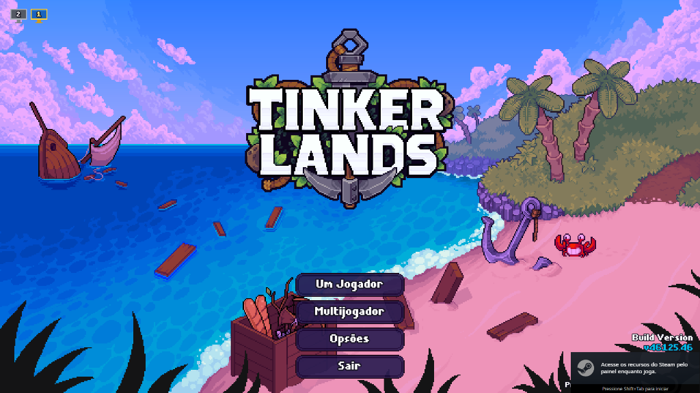

# 🖥️ Monitor Switcher Mod (v1.0)

[](https://github.com/telles0808)
[](https://opensource.org/licenses/MIT)
[]()
[]()

A seamless, pure native multi-monitor display switcher for **Tinkerlands** that allows switching the game window across screens with a single click from the main title screen in Borderless Fullscreen mode.



---

## 🌟 Key Features

* **🖥️ 1-Click Multi-Monitor Toggle:** Switch seamlessly between Monitor 1 (primary right display, `X = 0`) and Monitor 2 (secondary left display, `X = -1920`) right from the top-left corner of the title screen.
* **🎨 Distinct Visual States:**
  * **Active Display:** Vibrant golden bezel with cyan screen and bright yellow numbering.
  * **Inactive Displays:** Elegant metallic silver bezel with solid slate gray screen and crisp white numbering (100% visible day or night).
* **⚡ 100% Native GameMaker Execution:** Zero external dependencies, zero DLL hooks, zero PowerShell calls, zero background tasks. Pure native GML display calls.
* **🔒 Safe Native Boot:** Always defaults to Monitor 1 (primary display) on game restart.
* **📐 Responsive GUI Scaling:** Dynamically scales with `display_get_gui_height() / 1080.0`, maintaining pixel-perfect proportions across all resolutions.
* **🛡️ Zero Dimmer or Focus Bugs:** Preserves engine draw state with strict alpha isolation, ensuring title screen lighting and menu inputs are never interrupted.

---

## 📥 Installation

1. Download [`telles0808_id5005_monitor.mod`](https://github.com/telles0808/Tinkerlands-Mods/raw/main/releases/telles0808_id5005_monitor.mod).
2. Place `telles0808_id5005_monitor.mod` inside your game mods folder:
   ```
   C:\Program Files (x86)\Steam\steamapps\common\Tinkerlands\mods\
   ```
3. Launch Tinkerlands!

---

## 🛠️ Technical Details

* **Draw Layer:** Late-stage overlay hooked via `OnModDrawGUIEnd` inside `instance_exists(objMenuMain)`.
* **Repositioning Mechanism:**
  ```gml
  window_set_fullscreen(false);
  window_set_showborder(false);
  window_set_position(_mon.x, 0);
  window_set_size(1920, 1080);
  ```
* **Source Code:** [src/telles0808_id5005_monitor.gml](src/telles0808_id5005_monitor.gml)
