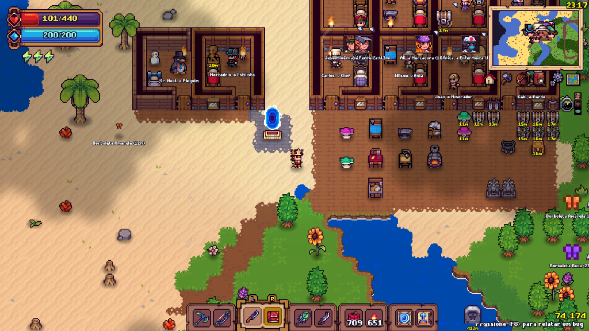
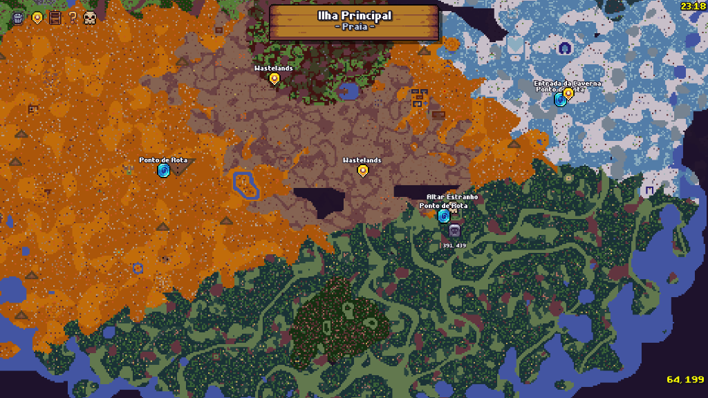

# 🧭 TomTom (v2.0) - Advanced GPS & Radar Navigation System

[](https://github.com/telles0808)
[](https://opensource.org/licenses/MIT)
[]()
[]()

**TomTom** is an advanced, high-performance navigation suite for **Tinkerlands**. It combines an interactive fullscreen map pin waypoint manager with an intelligent dual-layer off-screen radar tracking system for **NPCs**, **Monsters & Critters**, **World Chests**, **Multiplayer Companions**, and **Automatic Death Tombstones**.

---

## 📸 Screenshots & Showcase

| In-Game Dual-Layer Radar & NPC Names | Sonar HUD Controller & Player Radar | Fullscreen Map & Tombstone Pin |
| :---: | :---: | :---: |
|  |  |  |
| *Off-screen entities tracked with distance meters; on-screen NPC names snug beneath feet.* | *Master Sonar toggle with 3 dedicated sub-badges for NPCs, Chests, and Monsters.* | *Interactive map canvas with drag-and-drop pins, coordinate labels, and automatic death grave.* |

---

## 🌟 Key Features & Engine Mechanics

### 1. 🏹 Dual-Layer Off-Screen Radar (Anti-Overlap Engine)
When multiple entities (such as NPCs and nearby monsters) are in the same direction, standard radar mods draw all icons on top of each other, creating unreadable visual clutter. TomTom solves this with **geometric dual-layer radial separation**:
* **Outer Ring ($18\text{ px}$ from screen edge):** Reserved for **Monsters**, **Critters**, **Chests**, and **User Pins**.
* **Inner Ring ($48\text{ px}$ from screen edge):** Reserved for **NPCs** and **Multiplayer Companions**.
* **Directional Arrows & Meters:** Dynamic trigonometric vector calculation (`cos`/`-sin`) projects high-precision directional arrows with distance in meters (`Xm`) with comfortable vertical breathing room ($+3\text{ px}$).

### 2. 🪦 Automatic Death Tombstone Pin (`sprTombStone`)
* **Instant Death Detection:** Intercepts player health transitions (`MY_PLAYER.hp <= 0`) before respawn.
* **Corpse Location Saved:** Generates a persistent Death Pin on the exact tile of death using the native **`sprTombStone`** asset.
* **Full GPS Tracking:** Directs you straight back to your items upon respawning.
* **Map Trash Support:** Once you recover your loot, open the map (<kbd>M</kbd>) and drag the tombstone pin into the glowing red trash bin to delete it.

### 3. 👹 Entity & Mob Scanner (`instance_number(objMob)`)
* **Critter & Monster Identification:** Scans all active entities in the current network region (`netRegion`).
* **Real Representative Sprites:** Renders real creature sprites (e.g., Yellow, Purple, and Cyan Butterflies, Red & Blue Crabs, Rabbits, Slimes, Goblins, Bosses) instead of generic markers.
* **Bounding-Box Origin Normalization:** Normalizes bottom-center and custom sprite origins (`sprite_get_xoffset`, `sprite_get_yoffset`) so that floating distance tags are always geometrically centered right below the creature.

### 4. 👥 Intelligent NPC Rendering
* **Off-Screen:** Displays NPC character portraits and distance tags along the inner radar perimeter.
* **On-Screen (Clean World Aesthetics):** When an NPC enters your visible screen, the mod automatically hides the HUD portrait and renders the NPC's name centered directly beneath their feet (`_sy + 8 * _s`), leaving the world clean and immersive.

### 5. 🗺️ Interactive Fullscreen Map & Pins
* **5 Distinct Pin Categories:** Waypoint (📍), Storage (📦), Point of Interest (❓), Boss/Skull (💀), and Death Tombstone (🪦).
* **Drag-and-Drop Workflow:** Drag markers from the top-left palette onto any map terrain.
* **Live Tile Coordinates:** Displays real-time `(X, Y)` coordinate numbers beneath every pin on the map.
* **Illuminated Trash Bin:** Drag any pin into the top-left animated trash can to remove it.

### 6. 🔘 Sonar HUD Master Controller
* **Enlarged Master Sonar Button ($56\text{ px}$):** Click the Sonar accessory icon below the minimap to switch between **Screen Edge Radar Mode** and **Minimap GPS Mode**.
* **3 Independent Sub-Toggles:**
  * 👤 **Guide Icon:** Toggle NPC / Player tracking.
  * 📦 **Storage Icon:** Toggle Chest and Map Pin tracking.
  * 👹 **Goblin Icon:** Toggle Monster and Critter tracking.

### 7. 🧭 Zero-Clutter Minimap Border Projection
* Native Tinkerlands already renders NPC heads inside the minimap. To eliminate duplicated icons, TomTom only projects NPC portraits on the minimap frame border when the NPC is **outside** the minimap's visible bounds.

---

## 🕹️ Controls & Usage

| Action | Key / Interaction |
| :--- | :--- |
| **Open / Close Map** | Press <kbd>M</kbd> or click the map button below the minimap. |
| **Close Map** | Press <kbd>ESC</kbd> or <kbd>M</kbd>. |
| **Place New Pin** | Drag any marker from the top-left palette onto the map canvas. |
| **Move Existing Pin** | Click and drag the pin to a new position on the map. |
| **Delete Pin** | Drag any pin over the top-left trash can icon and release. |
| **Toggle Radar Mode** | Click the large Sonar button below the minimap. |
| **Toggle Categories** | Click any of the 3 sub-badges (NPC, Chest, Mob) next to the Sonar button. |

---

## 📥 Installation

1. Download [`telles0808_id5004_tomtom.mod`](https://github.com/telles0808/Tinkerlands-Mods/raw/main/releases/telles0808_id5004_tomtom.mod).
2. Place `telles0808_id5004_tomtom.mod` inside your game mods folder:
   ```
   C:\Program Files (x86)\Steam\steamapps\common\Tinkerlands\mods\
   ```
3. Launch Tinkerlands!

---

## 📜 Changelog (v2.0)

* **v2.0:**
  * **Dual-Layer Radar:** Implemented separated outer ($18\text{ px}$) and inner ($48\text{ px}$) margins to eliminate icon overlap.
  * **Death Pin System:** Added automatic death detection and persistent tombstone waypoint creation using `sprTombStone`.
  * **Mob & Critter Tracking Engine:** Rebuilt scanner with direct `objMob` instance indexing and real creature sprites.
  * **Bounding-Box Centering:** Compensated sprite origin offsets for entity sprites anchored at bottom-center.
  * **On-Screen Clean NPCs:** Automatically hides portraits on-screen and elevates name text snug beneath feet (`+8px`).
  * **Sub-Badge HUD Controller:** Added 3 modular toggles beside the enlarged $56\text{ px}$ Sonar button.
  * **Minimap Clutter Elimination:** Suppressed duplicate internal minimap blips for entities natively drawn by the base game.
* **v1.4:**
  * Initial interactive fullscreen map with drag-and-drop pins and illuminated trash bin.
  * Unified off-screen vector projection engine for NPCs and waypoints.
